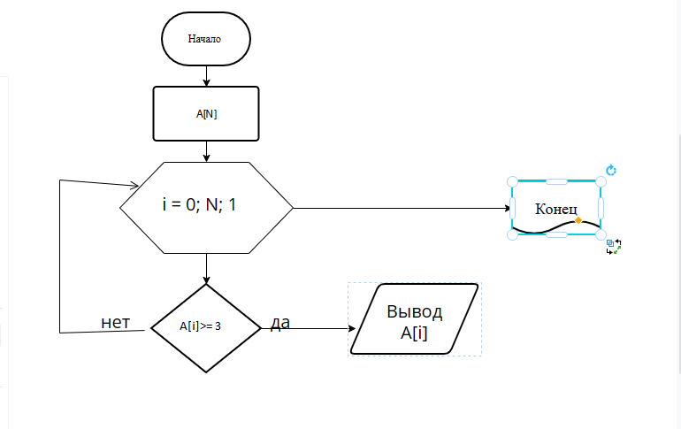

* (1-5 строки) *условия задачи*
* (6) *массив*
* (7) *создание функции*
* (8) *перебор массива*
* (10)  *конвертирование элемента массива*
* (11)  *проверка*
* (12)  *вывод элемента*
* (16) *Вызов функции*
